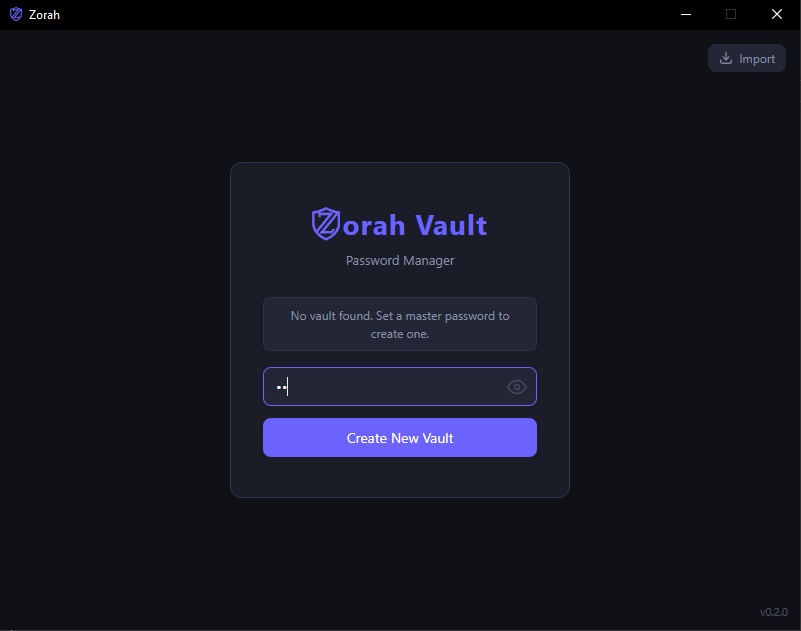
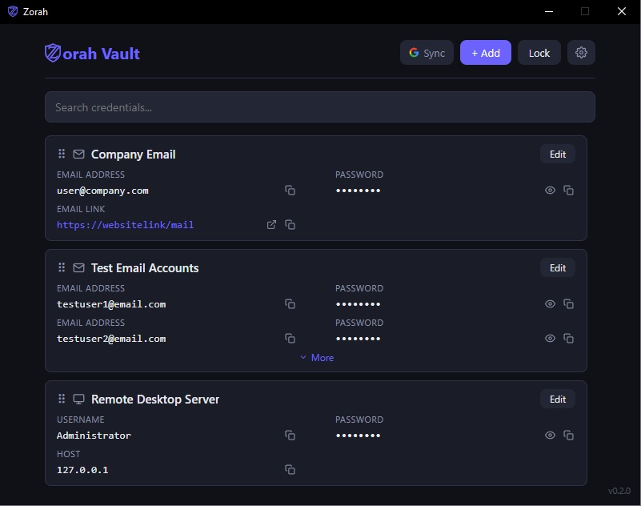
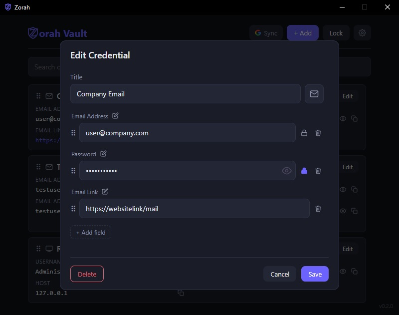

# Zorah Vault

## Screenshots

| Login | Vault | Edit Credential |
|-------|-------|-----------------|
|  |  |  |


A cross-platform password manager built with Tauri 2, React, and Rust.

## Features

- AES-256-GCM encrypted vault with binary file format
- Argon2id master password key derivation
- Custom credential types with icons
- Custom fields per credential (text, links, secrets)
- Global hotkey to show/hide (default `Alt+Shift+P`, configurable)
- Google Drive sync (optional)
- Drag-and-drop credential and Field reordering

## Prerequisites

### Windows
- [Node.js](https://nodejs.org) 18+
- [Rust](https://rustup.rs)
- [Microsoft C++ Build Tools](https://visualstudio.microsoft.com/visual-cpp-build-tools/)
- [WebView2](https://developer.microsoft.com/en-us/microsoft-edge/webview2/) (pre-installed on Windows 11)

### macOS
- [Node.js](https://nodejs.org) 18+
- [Rust](https://rustup.rs)
- Xcode Command Line Tools: `xcode-select --install`

### Linux (Debian/Ubuntu)
- [Node.js](https://nodejs.org) 18+
- [Rust](https://rustup.rs)
- System dependencies:
  ```bash
  sudo apt install libwebkit2gtk-4.1-dev libgtk-3-dev \
    libayatana-appindicator3-dev librsvg2-dev
  ```

## Setup

1. Clone the repository
2. Copy `src-tauri/.env.example` to `src-tauri/.env` and fill in the values:
   ```
   GOOGLE_CLIENT_ID=your_client_id.apps.googleusercontent.com
   GOOGLE_CLIENT_SECRET=your_client_secret
   GOOGLE_SCOPES=https://www.googleapis.com/auth/drive.appdata email profile
   AUTH_KEY_MATERIAL=your-random-secret-string
   ```
3. Install dependencies:
   ```bash
   npm install
   ```

## Development

```bash
npm run tauri dev
```

## Build

```bash
npm run tauri build
```

Outputs a native installer for the current platform under `src-tauri/target/release/bundle/`.

## Version

To update the version across all config files:

```bash
npm run version:set -- 1.2.3
```

## Data Storage

| File | Location |
|------|----------|
| Vault | `%APPDATA%\zorah\Vault\zorah.vault` (Windows) |
| | `~/Library/Application Support/zorah/Vault/zorah.vault` (macOS) |
| | `~/.local/share/zorah/Vault/zorah.vault` (Linux) |
| Google auth | Same directory as vault, `zorah.gauth` (encrypted binary) |
